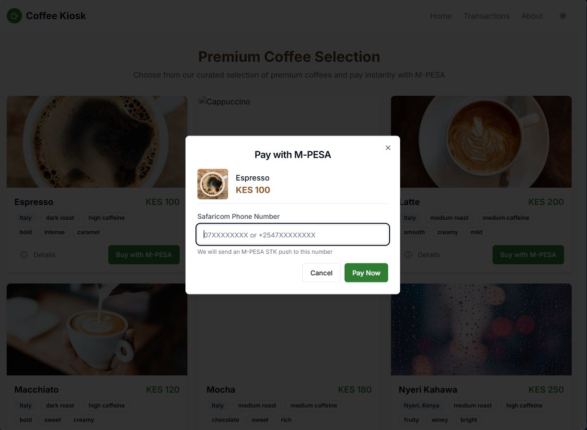
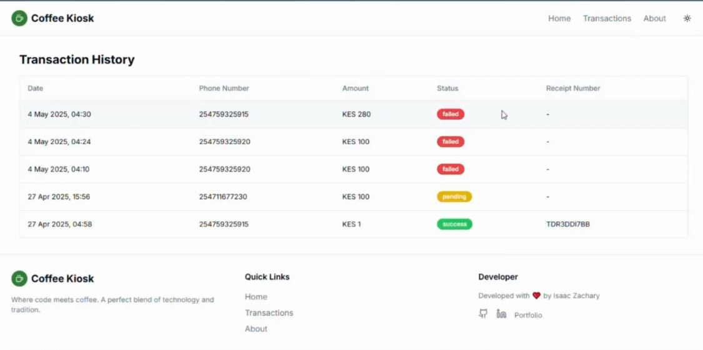

# ☕ Coffee Kiosk - M-PESA Payment Integration

[](https://reactjs.org/)
[](https://www.typescriptlang.org/)
[](https://nodejs.org/)
[](https://developer.safaricom.co.ke/)
[](LICENSE)
[](https://render.com)

A modern web application that combines the love for coffee with the convenience of M-PESA payments. Built with React, Node.js, and Safaricom's M-PESA API.

## 🌟 Live Demo

- Frontend: [https://coffee-kiosk-frontend.onrender.com](https://coffee-kiosk-frontend.onrender.com)
- Backend API: [https://coffee-kiosk-api.onrender.com](https://coffee-kiosk-api.onrender.com)

## 📸 Screenshots





## ✨ Features

- **Modern UI/UX**: Clean, responsive design with dark/light theme support
- **M-PESA Integration**: Seamless mobile payments using Safaricom's M-PESA
- **Real-time Updates**: Instant payment status updates
- **Transaction History**: View all your coffee purchases
- **Global Coffee Selection**: Featuring premium coffees from around the world
- **Developer-Friendly**: Code-themed coffee descriptions
- **Animations**: Smooth transitions and hover effects
- **Accessibility**: WCAG 2.1 compliant

## 🛠️ Tech Stack

### Frontend
- React 18+
- TypeScript
- Tailwind CSS
- Shadcn UI
- Vite
- React Router
- Axios
- Framer Motion

### Backend
- Node.js
- Express.js
- M-PESA API
- Supabase
- CORS

## 🚀 Deployment

### Prerequisites
- Node.js (v16 or higher)
- npm (v7 or higher)
- Git
- A Render.com account

### Deployment Steps

1. **Prepare Your Environment**
   ```bash
   # Clone the repository
   git clone https://github.com/IsaacZachary/CoffeeKiosk.git
   cd coffee-kiosk

   # Install dependencies
   cd backend && npm install
   cd ../frontend && npm install
   ```

2. **Configure Environment Variables**
   - Copy `.env.example` to `.env` in the backend directory
   - Update the following variables in `.env`:
     - `CONSUMER_KEY`
     - `CONSUMER_SECRET`
     - `PAYBILL`
     - `PASSKEY`
     - `CALLBACK_URL`
     - `SUPABASE_URL`
     - `SUPABASE_KEY`

3. **Deploy to Render.com**
   - Create two Web Services on Render.com
   - Connect your GitHub repository
   - Configure the services:
     - Backend:
       - Build Command: `cd backend && npm install`
       - Start Command: `cd backend && npm start`
     - Frontend:
       - Build Command: `cd frontend && npm install && npm run build`
       - Start Command: `cd frontend && npx serve dist -l $PORT`

## 💻 Local Development

1. **Start the Backend**
   ```bash
   cd backend
   npm install
   npm start
   ```

2. **Start the Frontend**
   ```bash
   cd frontend
   npm install
   npm run dev
   ```

## 📝 API Documentation

### Endpoints

#### POST /pay
Initiates an M-PESA payment.

**Request Body:**
```json
{
  "phone": "07XXXXXXXX",
  "amount": 100
}
```

**Response:**
```json
{
  "message": "Payment request sent successfully",
  "CheckoutRequestID": "ws_CO_12345"
}
```

#### POST /callback
Receives payment confirmation from M-PESA.

#### GET /transactions
Retrieves transaction history.

## 🔒 Security

- All sensitive credentials are stored in environment variables
- CORS is configured to only allow requests from trusted origins
- Input validation is implemented for all endpoints
- HTTPS enforced for all API calls

## 👨‍💻 Developer

- **Name**: Isaac Zachary
- **GitHub**: [@IsaacZachary](https://github.com/IsaacZachary)
- **LinkedIn**: [Isaac Zachary](https://linkedin.com/in/isaaczachary)

## 🤝 Contributing

Contributions are welcome! Please feel free to submit a Pull Request.

## 📄 License

MIT 
